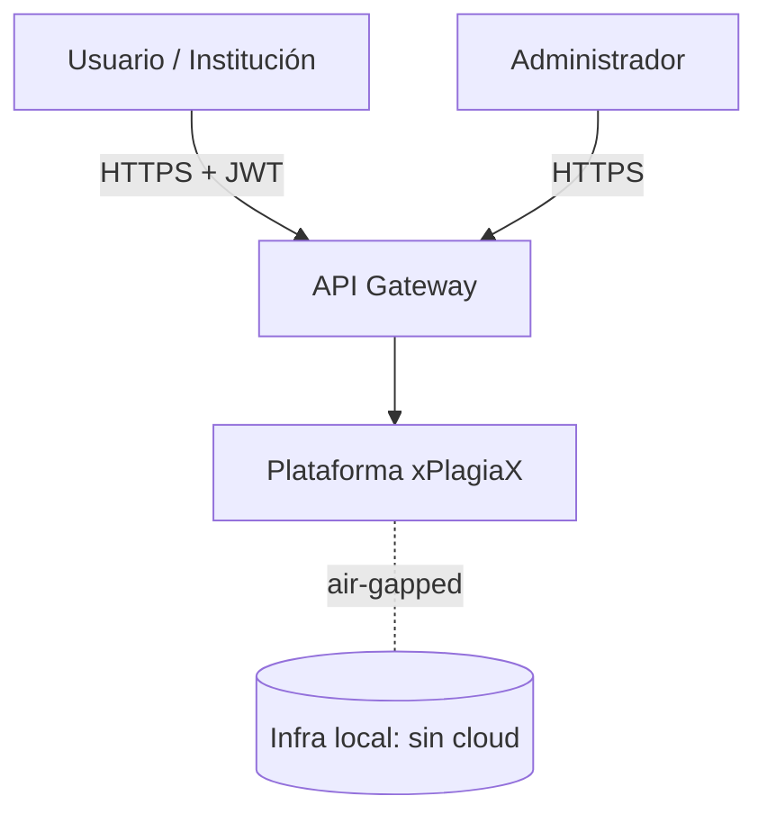
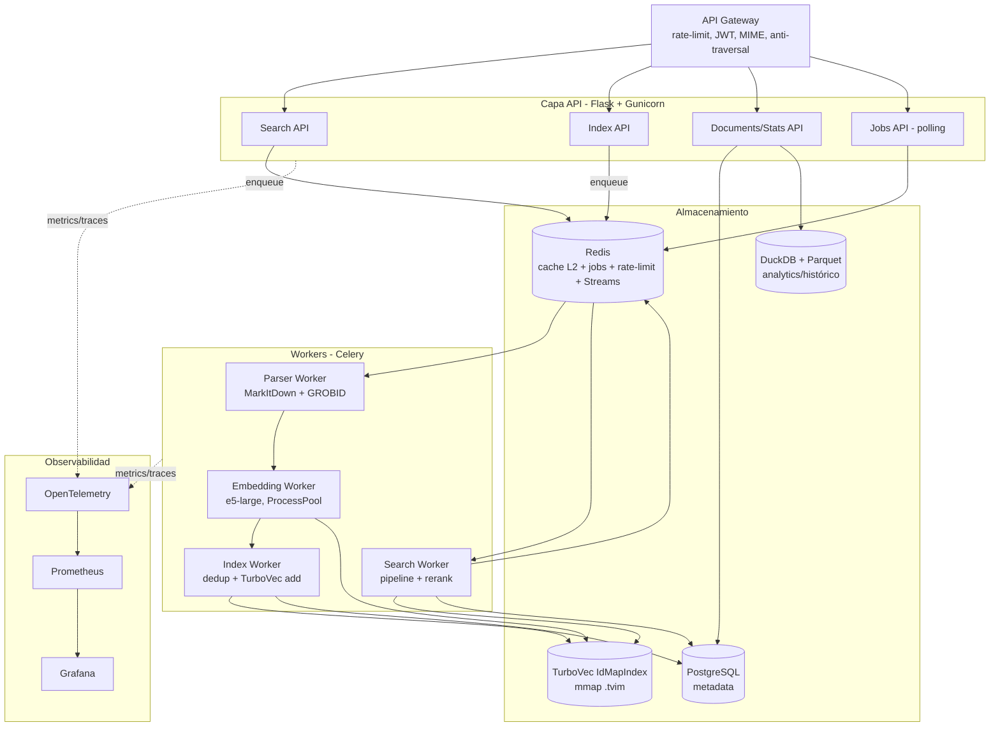
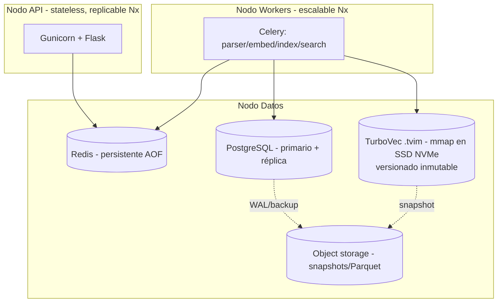
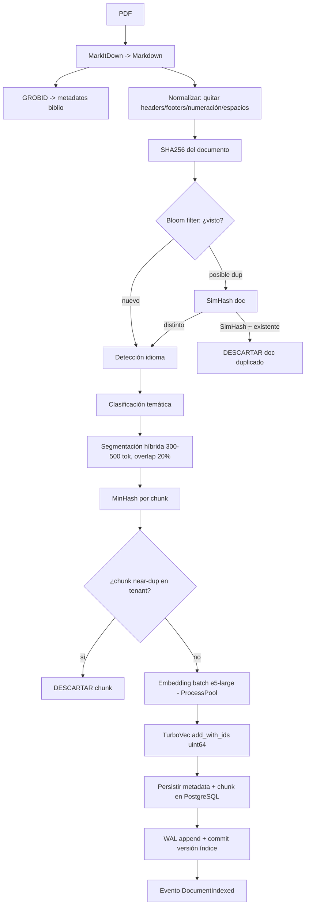
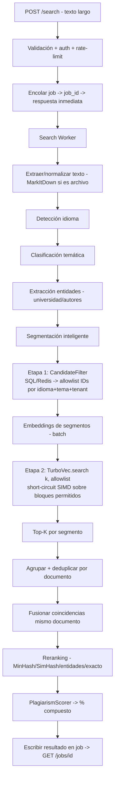

# xPlagiaX — Plataforma SOTA de Detección de Plagio Semántico

> **Fase 0 — Documento de Arquitectura (ADR maestro).**
> Fuente única de verdad. Ninguna decisión arquitectónica nueva debe tomarse fuera de este documento.
> **No contiene código.** Define objetivos, requisitos, arquitectura, dominio (DDD), APIs, flujos y decisiones justificadas.

---

## 0. Índice

1. Objetivos
2. Requisitos Funcionales (RF)
3. Requisitos No Funcionales (NFR) + análisis de factibilidad física
4. Restricciones
5. Riesgos y mitigaciones
6. Arquitectura general (C4: Contexto → Contenedores → Componentes)
7. Diagrama de despliegue
8. Modelo de dominio (DDD)
9. Contratos de API (OpenAPI, resumen)
10. Flujo de indexación
11. Flujo de búsqueda
12. Algoritmo híbrido de plagio
13. Estrategia de almacenamiento
14. Cache multinivel
15. Concurrencia y paralelismo
16. Observabilidad
17. Versionado, WAL y recuperación del índice
18. Registros de decisión (ADR-001 … ADR-0NN)
19. Árbol del proyecto objetivo
20. Mejoras futuras

---

## 1. Objetivos

**Objetivo principal.** Diseñar e implementar una plataforma de detección de plagio semántico de nivel empresarial (Enterprise SOTA), basada en **TurboVec** (índice TurboQuant), capaz de indexar millones de segmentos de documentos académicos y realizar búsquedas semánticas híbridas con latencia P95 < 100 ms en consultas simples, optimizada para mínimo consumo de RAM residente y CPU, operable completamente en infraestructura local (air-gapped) sin dependencia de servicios cloud.

**Objetivos derivados.**

- Búsqueda de dos etapas *filtro-primero*: idioma + tema reducen el espacio de candidatos **antes** de tocar el índice vectorial (menos RAM, menos CPU, mayor precisión, menos falsos positivos).
- Indexación idempotente con deduplicación en cascada (SHA256 → Bloom → SimHash → MinHash → TurboVec) — nunca almacenar el mismo PDF/párrafo/chunk dos veces.
- Score de plagio **compuesto** (embedding + tema + idioma + huellas + entidades + coincidencia exacta), no solo coseno.
- Procesamiento asíncrono con polling (Job ID) para documentos grandes y miles de usuarios concurrentes sin bloquear el proceso web.
- Multi-tenant con aislamiento lógico por institución.

**No-objetivos (scope-out explícito).**

- No es un servicio cloud gestionado. No hay datos saliendo del perímetro.
- No genera embeddings *dentro* de TurboVec (TurboVec es **solo** el índice; los embeddings los produce un servicio dedicado).
- No OCR salvo PDF escaneado detectado (fallback opcional, no en camino crítico).

---

## 2. Requisitos Funcionales (RF)

| ID | Requisito |
|----|-----------|
| RF-01 | Crear/cargar base vectorial local con TurboVec `IdMapIndex` (IDs `uint64` persistentes, `remove()` O(1)). |
| RF-02 | Indexar carpeta local recursiva (`POST /index/folder`) y subida múltiple de PDFs (`POST /index/upload`). |
| RF-03 | Extraer texto de PDF con **Microsoft MarkItDown**; GROBID para metadatos bibliográficos (autores, título, afiliación, referencias). |
| RF-04 | Limpiar Markdown: eliminar encabezados repetidos, pies de página, numeración; normalizar espacios. |
| RF-05 | Segmentar con estrategia híbrida (doble salto de línea → punto final → longitud de tokens), 300–500 tokens, overlap 20%, preservando contexto. |
| RF-06 | Detectar idioma automáticamente (fastText, fallback langdetect) y persistir en metadata. |
| RF-07 | Clasificar tema por embeddings (centroides por dominio), no solo palabras clave. |
| RF-08 | Extraer entidades: universidad, facultad, carrera, autores, año, título; `null` si no se hallan. |
| RF-09 | Generar embeddings con modelo multilingüe configurable (por defecto `multilingual-e5-large`) tras una interfaz intercambiable. |
| RF-10 | Deduplicación previa a indexar: SHA256 exacto → Bloom filter → SimHash (near-dup doc) → MinHash (near-dup chunk). |
| RF-11 | Búsqueda: `POST /search` recibe texto largo, ejecuta pipeline completo, devuelve documentos con % de plagio, universidad, autores, idioma, tema, chunk más parecido y su posición. |
| RF-12 | Modos de búsqueda: exacto, semántico, plagio, híbrido, temático, por idioma, por universidad, por autor, por fecha, multicriterio. |
| RF-13 | Procesamiento asíncrono: `POST /search` y `/index/*` devuelven `job_id`; `GET /jobs/{id}` para polling de estado y resultado. |
| RF-14 | CRUD de documentos: `GET /documents`, `GET /documents/{id}`, `DELETE /documents/{id}`. |
| RF-15 | `GET /stats` (métricas del corpus), `POST /rebuild-index` (reconstrucción controlada). |
| RF-16 | Documentación OpenAPI 3 / Swagger autogenerada. |
| RF-17 | Multi-tenant: toda operación scoped por `tenant_id`; filtrado por allowlist de IDs en TurboVec. |

---

## 3. Requisitos No Funcionales (NFR)

| ID | NFR | Objetivo | Cómo se logra |
|----|-----|----------|---------------|
| NFR-01 | Latencia búsqueda simple | P95 < 100 ms | Filtro idioma+tema (allowlist), kernel SIMD TurboVec, cache L1/L2 |
| NFR-02 | Latencia documento largo (100–300 pág) | P95 < 300 ms (async) | Segmentación + búsqueda paralela, polling |
| NFR-03 | RAM **residente** por nodo | < 0.5 GB @ 10M chunks | **mmap** del índice (ver §3.1) |
| NFR-04 | CPU media por nodo | < 10% a carga nominal | Cuantización, allowlist short-circuit, batch |
| NFR-05 | Throughput | ≥ 5000 consultas/min con escalado horizontal | Nodos stateless + índice mmap compartido/replicado |
| NFR-06 | Escalado | Lineal al añadir nodos, sin downtime | Réplicas stateless, índice versionado inmutable |
| NFR-07 | Durabilidad | Cero pérdida ante fallo | WAL + checkpoints + snapshots |
| NFR-08 | Indexación incremental | Sin detener servicio, sin rebuild completo | Append online de TurboVec + compaction en background |
| NFR-09 | Disponibilidad | Circuit breaker, bulkhead, backpressure, retry | Resiliencia por componente |
| NFR-10 | Seguridad | Validación archivos, límite tamaño, MIME, anti path-traversal, rate limit, JWT/API-keys | Capa de borde |
| NFR-11 | Calidad de código | typing completo, Pydantic, docstrings Google, Ruff+Black+MyPy, cobertura ≥ 80% | CI |

### 3.1 Análisis de factibilidad física del NFR-03 (0.5 GB / 10M chunks)

**Cálculo honesto.** `multilingual-e5-large` = dim 1024.

- TurboVec 2-bit: 1024 × 2 bits = 2048 bits = **256 B/vector** + escalares (norma + renorm ≈ 8 B) ≈ 264 B.
- 10M chunks × 264 B ≈ **2.64 GB en disco**.
- Mapa de IDs `IdMapIndex` (uint64): 10M × 8 B = 80 MB.
- **Total on-disk ≈ 2.7 GB.**

> **Conclusión:** 0.5 GB *no es alcanzable por carga en memoria directa* — es físicamente imposible almacenar 10M embeddings útiles en 0.5 GB.
>
> **Reconciliación (decisión de arquitectura ADR-007):** el índice se abre con **memory mapping (mmap)**. El fichero `.tvim` reside en disco (SSD NVMe); el kernel pagina bajo demanda. El **RSS (resident set size)** queda limitado al working-set caliente — las páginas realmente tocadas por las consultas recientes. Con localidad de acceso decente y `madvise(RANDOM/WILLNEED)`, el residente se mantiene por debajo de 0.5 GB aunque el índice total sea 2.7 GB.
>
> **Trade-off:** la primera consulta que toca páginas frías paga E/S de disco (fallo de página). Se mitiga con warm-up opcional (`madvise WILLNEED`) por partición idioma+tema y cache L2 de resultados. Si se exige RAM residente aún menor, la palanca es reducir dimensión (modelo de 256/384 dims) o bit-width, sacrificando recall.

**CPU <10% (NFR-04):** válido como media por nodo a **carga nominal** (no pico). Bajo ráfaga de 5000 q/min la CPU sube; el objetivo se cumple por-nodo repartiendo con escalado horizontal. Se documenta como objetivo de estado estacionario, no de saturación.

---

## 4. Restricciones

- **Lenguaje/stack fijo:** Python 3.12, Flask, Gunicorn, Docker/Compose, dependencias con Poetry o uv.
- **Vector store exclusivo:** TurboVec `IdMapIndex`. Prohibido FAISS/Chroma/Qdrant/Milvus/Pinecone/Weaviate.
- **Extracción de PDF:** MarkItDown (no PyPDF2/pdfminer; OCR solo si escaneado).
- **Air-gapped:** todos los modelos (embeddings, fastText, GROBID) empaquetados localmente; sin llamadas de red saliente.
- **Persistencia:** metadata en PostgreSQL; embeddings solo en TurboVec; relación por ID `uint64`.

---

## 5. Riesgos y mitigaciones

| Riesgo | Impacto | Mitigación |
|--------|---------|------------|
| TurboVec es índice puro (no filtra por metadata rica) | Filtrado limitado a allowlist de IDs | Etapa 1 SQL/Redis produce allowlist; etapa 2 rerank denso en TurboVec |
| mmap → fallos de página en cola fría | Latencia P99 alta en primeras consultas | Warm-up `madvise`, cache L2, particionado por idioma+tema |
| Pérdida de recall por cuantización 2-bit en dims bajas | Falsos negativos | Usar 4-bit donde recall crítico; TQ+ calibración; renormalización de longitud |
| Metadatos ausentes/erróneos (GROBID) | Entidades `null`, score entidad degradado | Score compuesto tolera nulos (peso re-normalizado); MarkItDown como complemento |
| Deriva de tema mal clasificado | Filtro descarta candidatos válidos | Umbral de confianza; fallback a búsqueda sin filtro temático si confianza baja |
| Crecimiento del índice sin compaction | Fragmentación, RAM/disco | Background compaction + versionado inmutable + snapshot |
| Multi-tenant leakage | Fuga de datos entre instituciones | `tenant_id` obligatorio en allowlist; tests de aislamiento |

---

## 6. Arquitectura general (C4)

### 6.1 Nivel 1 — Contexto



### 6.2 Nivel 2 — Contenedores



### 6.3 Nivel 3 — Componentes (por servicio)

**Parser Service** — `PdfLoader` · `MarkItDownAdapter` · `GrobidAdapter` · `TextNormalizer` (elimina headers/footers/numeración) · `ScannedPdfDetector` (→ OCR opcional).

**Segmentation Service** — `HybridChunker` (doble-\n → punto → tokens) · `OverlapWindow` (20%) · `TokenCounter` · `AdaptiveChunker` (tamaño según estructura semántica).

**Embedding Service** — `EmbeddingModel` (interfaz) · `E5LargeAdapter` · `BatchEncoder` (SIMD-aware batching) · `EmbeddingCache`.

**Language Service** — `FastTextDetector` · `LangDetectFallback`.

**Topic Service** — `TopicClassifier` (centroides por dominio) · `TopicCentroidStore`.

**Dedup Service** — `Sha256Hasher` · `BloomFilter` · `SimHasher` · `MinHasher` · `DuplicatePolicy`.

**Vector Service** — `TurboVecRepository` (wrap `IdMapIndex`) · `IndexVersionManager` · `AllowlistBuilder` · `IndexSnapshotter`.

**Metadata Service** — `DocumentRepository` · `ChunkRepository` (SQLAlchemy) · `MetadataMapper`.

**Search Service** — `SearchPipeline` · `CandidateFilter` (idioma+tema→allowlist) · `Reranker` · `ResultAggregator` (fusión por documento) · `PlagiarismScorer`.

**Job Service** — `JobRepository` (Redis) · `JobStateMachine` (`PENDING→RUNNING→DONE/FAILED`).

**Edge/Cross-cutting** — `RateLimiter` · `AuthGuard (JWT/API-key)` · `FileValidator (MIME, tamaño, traversal)` · `CircuitBreaker` · `Bulkhead` · `StructuredLogger`.

---

## 7. Diagrama de despliegue



Kubernetes-ready: cada contenedor con `readiness`/`liveness` probes; índice montado como volumen RWX o replicado por nodo; HPA sobre CPU/latencia; Helm charts.

---

## 8. Modelo de dominio (DDD)

### 8.1 Bounded Contexts

| Contexto | Responsabilidad | Lenguaje ubicuo |
|----------|-----------------|-----------------|
| **Ingestion** | Cargar, parsear, limpiar, segmentar, deduplicar, indexar | Document, Chunk, Fingerprint, IndexEntry |
| **Retrieval** | Buscar, filtrar candidatos, rerankear, puntuar plagio | Query, Candidate, MatchResult, PlagiarismScore |
| **Catalog** | Metadatos, autores, instituciones, temas, CRUD | DocumentRecord, Author, Institution, Topic |
| **Jobs** | Orquestación asíncrona, polling | Job, JobStatus |
| **Tenancy** | Aislamiento, cuotas, auth | Tenant, ApiKey, Quota |

### 8.2 Agregados, entidades y value objects

**Agregado `Document` (raíz)** — Ingestion/Catalog
- Identidad: `DocumentId (uuid)`.
- VOs: `Sha256Hash`, `SimHash`, `PdfMetadata(nombre, ruta, páginas)`, `BibliographicMetadata(título, autores[], institución, facultad, carrera, año)`, `Language`, `Topic`, `Keywords`.
- Contiene: colección de `Chunk`.
- Invariantes: no puede indexarse si `Sha256Hash` ya existe en el tenant; `Language`/`Topic` obligatorios antes de indexar.

**Entidad `Chunk`** — dentro de `Document`
- Identidad: `ChunkId (uint64)` = ID persistente en TurboVec `IdMapIndex`.
- VOs: `ChunkText`, `TokenSpan(inicio, fin, página)`, `MinHashSignature`, `EmbeddingRef(vector_id)`.
- Invariante: `ChunkId` es la misma clave en PostgreSQL y en TurboVec (relación 1:1).

**Agregado `SearchQuery` (raíz)** — Retrieval
- VOs: `RawText`, `DetectedLanguage`, `DetectedTopic`, `QueryEntities`, `SearchMode`.
- Produce: `SearchResult` (colección de `DocumentMatch`).

**VO `DocumentMatch`**
- `documento`, `universidad`, `autores[]`, `idioma`, `tema`, `similaridad (0–100)`, `chunks (nº coincidencias)`, `chunk_mas_parecido{texto, score, posición}`.

**VO `PlagiarismScore`** — resultado del scorer compuesto (ver §12).

**Agregado `Job`** — Jobs
- Identidad: `JobId`. Estado: `JobStatus (PENDING/RUNNING/DONE/FAILED)`. Payload + resultado.

**Agregado `Tenant`** — Tenancy
- `TenantId`, `ApiKey[]`, `Quota`, `IndexPartitionRef`.

### 8.3 Repositorios (puertos — arquitectura hexagonal)

- `DocumentRepository` (PostgreSQL) · `ChunkRepository` (PostgreSQL) · `VectorIndexRepository` (TurboVec) · `FingerprintRepository` (Redis+PG) · `JobRepository` (Redis) · `TopicCentroidRepository` · `TenantRepository`.

### 8.4 Servicios de dominio

- `IndexingPipeline` (orquesta dedup→embed→index) · `SearchPipeline` · `PlagiarismScorer` · `CandidateFilter` · `DeduplicationPolicy` · `ResultAggregator`.

### 8.5 Eventos de dominio

`DocumentReceived` → `TextExtracted` → `DocumentDeduplicated` → `DocumentChunked` → `ChunksEmbedded` → `DocumentIndexed` → `IndexVersionCommitted`.
`SearchRequested` → `CandidatesFiltered` → `VectorSearched` → `ResultsReranked` → `PlagiarismScored` → `SearchCompleted`.

### 8.6 Commands / Queries (CQRS)

- **Commands:** `IndexFolderCommand`, `IndexUploadCommand`, `DeleteDocumentCommand`, `RebuildIndexCommand`.
- **Queries:** `SearchQuery`, `GetDocumentQuery`, `ListDocumentsQuery`, `GetStatsQuery`, `GetJobQuery`.
- Escritura (index) y lectura (search/stats) separadas: índice es fuente para lectura, PostgreSQL+DuckDB para catálogo/analítica.

---

## 9. Contratos de API (OpenAPI 3 — resumen)

| Método | Ruta | Entrada | Salida | Modo |
|--------|------|---------|--------|------|
| POST | `/index/upload` | multipart PDFs + metadata opcional | `{job_id}` | async |
| POST | `/index/folder` | `{path, recursive:true}` | `{job_id}` | async |
| POST | `/search` | `{text, mode, filters?, top_k?}` | `{job_id}` | async |
| GET | `/jobs/{id}` | — | `{status, progress, result?}` | polling |
| GET | `/documents` | `?tenant&topic&lang&page` | lista paginada | sync |
| GET | `/documents/{id}` | — | documento + chunks | sync |
| DELETE | `/documents/{id}` | — | `{deleted:true}` (remove O(1) en TurboVec) | sync |
| GET | `/stats` | — | corpus, nº chunks, RAM, versión índice | sync |
| POST | `/rebuild-index` | `{tenant?}` | `{job_id}` | async |
| GET | `/health` `/ready` | — | probes | sync |
| GET | `/metrics` | — | Prometheus | sync |

**Respuesta de `/search` (resultado del job) — contrato:**

```json
{
  "query_language": "es",
  "query_topic": "Ingeniería de Software",
  "global_plagiarism_percent": 91.4,
  "documents": [
    {
      "documento": "tesis.pdf",
      "universidad": "Universidad Nacional",
      "autores": ["Juan Pérez"],
      "idioma": "es",
      "tema": "Ingeniería de Software",
      "similaridad": 96.8,
      "chunks": 12,
      "chunk_mas_parecido": {
        "texto": "...",
        "score": 0.98,
        "pagina": 14,
        "span": [1203, 1560]
      }
    }
  ]
}
```

---

## 10. Flujo de indexación



Idempotente: reintentos seguros (dedup por SHA256 + Bloom). Incremental: `add_with_ids` online sin rebuild. Concurrente: extracción/embeddings en ProcessPool (CPU-bound), E/S en ThreadPool.

---

## 11. Flujo de búsqueda (filtro-primero)



**Por qué filtro-primero:** el `allowlist` de TurboVec descarta bloques de 32 vectores no permitidos **antes** de cualquier lookup LUT. Un allowlist selectivo (idioma+tema) evita la mayor parte del coste SIMD → menos CPU, menos páginas mmap tocadas (menos RAM residente), menor latencia, mayor precisión.

---

## 12. Algoritmo híbrido de plagio

Score compuesto (config declarativa, pesos re-normalizados si algún componente es `null`):

```
PlagiarismScore =
    0.35 * embedding_similarity      (coseno reranked TurboVec)
  + 0.20 * topic_similarity          (coseno de centroides de tema)
  + 0.15 * language_match            (1.0 mismo idioma, 0 distinto)
  + 0.10 * minhash_similarity        (Jaccard estimado)
  + 0.10 * simhash_similarity        (1 - hamming/bits)
  + 0.05 * entity_match              (universidad/autores/institución)
  + 0.05 * exact_sentence_match      (n-gram/rolling hash)
  = valor 0..1  ->  x100 = porcentaje
```

**Reglas de veredicto:**

| % | Veredicto |
|---|-----------|
| ≥ 95 | Plagio casi idéntico |
| 85–95 | Alta probabilidad |
| 70–85 | Coincidencia importante |
| 50–70 | Similitud temática |
| < 50 | Baja similitud |

> Nota: la variante de 4 términos del prompt original (0.65/0.20/0.10/0.05) queda como **perfil configurable** `simple`; el perfil por defecto es el híbrido de 7 términos (`sota`). Pesos externalizados en config → intercambiables sin redeploy.

---

## 13. Estrategia de almacenamiento

| Store | Contenido | Motivo |
|-------|-----------|--------|
| **TurboVec** `.tvim` (mmap, SSD) | Embeddings cuantizados + IDs `uint64` | Compresión 16×, SIMD, allowlist, remove O(1) |
| **PostgreSQL** | Metadata documento/chunk, autores, instituciones, temas | Consultas relacionales, filtros, allowlist etapa-1 |
| **Redis** | Cache L2, jobs, sesiones, rate-limit, Bloom filter, Streams (cola) | Baja latencia, TTL |
| **DuckDB + Parquet** | Analytics, estadísticas, histórico, reportes | OLAP embebido, columnar, sin servidor |
| **Object storage** | Snapshots del índice, WAL archivado, backups PG | Recuperación, versionado |

Relación TurboVec↔PostgreSQL por `ChunkId (uint64)` = clave única compartida.

---

## 14. Cache multinivel

- **L1 (in-process, LRU):** embeddings de query recientes, centroides de tema, resultados calientes. Vive en el worker.
- **L2 (Redis):** resultados de búsqueda por hash(texto+modo+tenant), TTL configurable; deduplicación de trabajo entre workers.
- **Invalidación:** al indexar/borrar documentos de un tenant se invalida el namespace L2 de ese tenant.
- **Efecto:** consultas repetidas no tocan TurboVec → protege NFR-01/03/04.

---

## 15. Concurrencia y paralelismo

| Carga | Mecanismo | Razón |
|-------|-----------|-------|
| Extracción PDF, embeddings | `ProcessPoolExecutor` (Celery) | CPU-bound, evita GIL |
| E/S disco/red, PostgreSQL | `ThreadPoolExecutor` / async | I/O-bound |
| Cola de trabajos | Redis Streams / Celery | Desacople, backpressure |
| Búsqueda por segmentos | Batch + paralelo | Documento largo < 300 ms |

Resiliencia: **Circuit Breaker** (dependencias caídas), **Bulkhead** (aislar pools por tipo de tarea), **Backpressure** (límite de cola → 429), **Retry con backoff** (2s/4s/8s/16s). Estructuras del índice inmutables por versión → lecturas lock-free; escrituras append con copy-on-write en compaction.

---

## 16. Observabilidad

- **Métricas (Prometheus):** latencia P50/P95/P99 por endpoint, RSS del índice, páginas mmap, tasa de fallos de página, hit-ratio cache L1/L2, CPU, profundidad de cola, recall estimado, % dedup.
- **Trazas (OpenTelemetry):** span por etapa del pipeline (parse→embed→filter→search→rerank→score).
- **Logs:** estructurados JSON, rotación, niveles, `trace_id` correlacionado.
- **Dashboards (Grafana):** SLOs (NFR-01…05), salud de workers, crecimiento del corpus.
- **Health:** `/health` (liveness), `/ready` (readiness: índice montado + PG + Redis).

---

## 17. Versionado, WAL y recuperación del índice

- **Versionado inmutable:** cada commit de indexación produce una versión lógica; lectores usan una versión fija (lock-free). Hot-reload atómico al publicar nueva versión.
- **WAL:** toda mutación (add/remove) se escribe primero al log → replay ante fallo antes de `ack`.
- **Checkpoints/Snapshots:** `index.write(.tvim)` periódico → object storage; recuperación = load del último snapshot + replay del WAL posterior.
- **Compaction en background:** consolida deletes/fragmentación sin downtime (copy-on-write, swap atómico de versión).
- **Reindexación incremental:** `rebuild-index` reconstruye por particiones (tenant/idioma/tema), no todo el corpus a la vez.

---

## 18. Registros de decisión (ADR)

| ADR | Decisión | Justificación |
|-----|----------|---------------|
| ADR-001 | Clean + Hexagonal + DDD, puertos/adaptadores | Desacople del dominio de Flask/TurboVec/PG; testabilidad; intercambiar embedding model o store sin tocar dominio |
| ADR-002 | TurboVec `IdMapIndex` como único vector store | Requisito; IDs persistentes uint64, remove O(1), 16× compresión, SIMD, allowlist |
| ADR-003 | Embeddings **fuera** de TurboVec, interfaz `EmbeddingModel` | TurboVec no genera embeddings; modelo intercambiable (e5-large por defecto, multilingüe) |
| ADR-004 | Búsqueda filtro-primero (idioma+tema→allowlist) | Reduce espacio, CPU, RAM residente, falsos positivos |
| ADR-005 | Async + polling (job_id) | Documentos grandes y miles de usuarios sin bloquear Flask |
| ADR-006 | Dedup en cascada SHA256→Bloom→SimHash→MinHash | Barato→caro; corta temprano; evita almacenar duplicados |
| ADR-007 | Índice vía **mmap** | Único camino físicamente viable para RAM residente baja con 10M chunks (§3.1) |
| ADR-008 | Score de plagio compuesto de 7 términos, pesos en config | Más robusto que coseno solo; perfil `simple` vs `sota` sin redeploy |
| ADR-009 | Poliglot persistence (TurboVec/PG/Redis/DuckDB) | Cada store para su carga; no todo en PG |
| ADR-010 | Índice versionado inmutable + WAL + snapshot | Cero pérdida, hot-reload, lecturas lock-free |
| ADR-011 | Multi-tenant por allowlist de IDs + `tenant_id` | Aislamiento lógico sin índices separados por tenant |
| ADR-012 | GROBID + MarkItDown para metadatos | MarkItDown extrae texto; GROBID especializa autores/afiliación/refs |

---

## 19. Árbol del proyecto objetivo (se detalla en Fase 2)

```
xplagiax/
  app/
    api/            # controllers Flask, schemas, error handlers
    domain/         # entities, value_objects, events, ports (repos, services)
    application/    # commands, queries, pipelines (use cases)
    infrastructure/
      vectorstore/  # TurboVecRepository (adapter IdMapIndex)
      metadata/     # SQLAlchemy repos PostgreSQL
      embeddings/   # E5LargeAdapter, BatchEncoder
      parsers/      # MarkItDown, GROBID, normalizer
      chunking/     # HybridChunker, AdaptiveChunker
      language/     # fastText adapter
      topic/        # classifier + centroides
      dedup/        # sha256, bloom, simhash, minhash
      cache/        # L1 LRU, L2 Redis
      jobs/         # Redis job repo, state machine
      persistence/  # WAL, snapshots, versioning
    workers/        # Celery tasks
    config/         # settings Pydantic, .env
    utils/          # logging JSON, resilience (breaker/bulkhead)
  tests/            # unit, integration, load
  docs/             # este ADR, OpenAPI, diagramas
  deploy/           # Dockerfile, docker-compose.yml, helm/, Makefile
  pyproject.toml
```

---

## 20. Mejoras futuras

- Adaptive chunking guiado por estructura semántica (no solo tokens).
- Zero-copy inter-proceso con Apache Arrow entre parser→embed→index.
- NUMA-awareness y pinning de workers en hardware multi-socket.
- Cross-encoder opcional para rerank de precisión en top-N pequeño.
- Detección de paráfrasis translingüe (plagio ES↔EN) explotando el espacio multilingüe compartido de e5.
- Sharding horizontal del índice por partición idioma+tema para >100M embeddings.

---

*Fin Fase 0. Siguiente: Fase 1 — Modelo de dominio detallado (Opus). Luego Fase 2 — árbol + contratos. Implementación (Sonnet) solo tras aprobar este ADR.*
