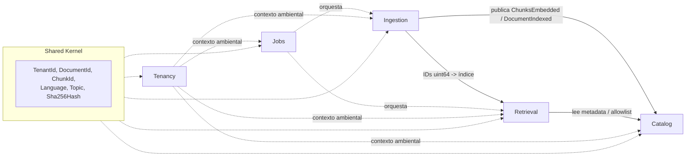
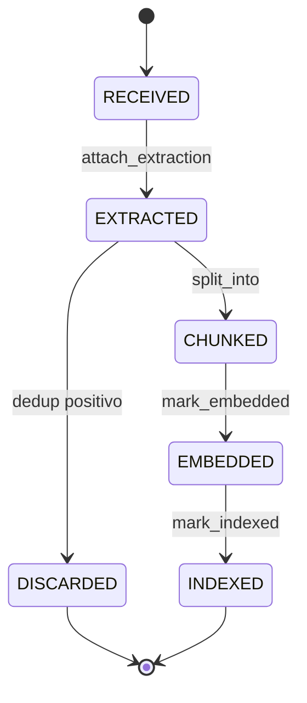
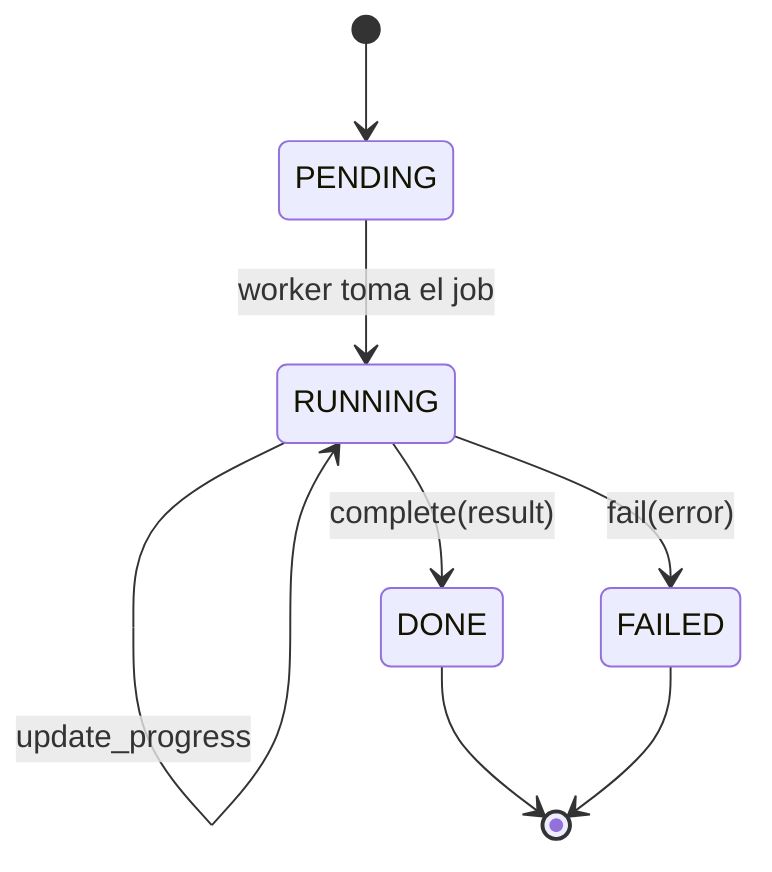
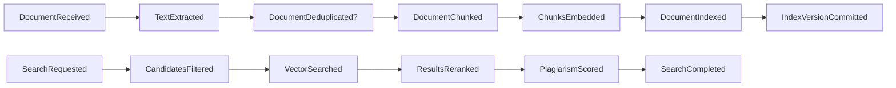

# xPlagiaX — Fase 1: Modelo de Dominio (DDD detallado)

> Diseño táctico de DDD. **Sin código.** Deriva del ADR maestro (`docs/ARCHITECTURE.md`) y es su fuente única de verdad para el dominio.
> Notación de firmas: pseudo-tipos para contrato, no implementación (`nombre: Tipo`).

---

## 0. Índice

1. Mapa de contextos (Context Map)
2. Contexto **Ingestion**
3. Contexto **Retrieval**
4. Contexto **Catalog**
5. Contexto **Jobs**
6. Contexto **Tenancy**
7. Value Objects compartidos (Shared Kernel)
8. Repositorios (puertos)
9. Servicios de dominio
10. Factories
11. Policies (reglas de negocio)
12. Eventos de dominio
13. Commands / Queries (CQRS)
14. Sagas / procesos largos
15. Invariantes globales
16. Glosario (lenguaje ubicuo)

---

## 1. Mapa de contextos (Context Map)



**Relaciones (patrones de integración):**

| Upstream → Downstream | Patrón | Contrato |
|-----------------------|--------|----------|
| Ingestion → Catalog | Customer/Supplier (eventos) | `DocumentIndexed`, `ChunksEmbedded` |
| Ingestion → Retrieval | Shared Kernel (`ChunkId uint64` = clave común TurboVec↔PG) | ID persistente |
| Retrieval → Catalog | Conformist (lee metadata para filtrar/rerankear) | `DocumentRecord` |
| Tenancy → * | Contexto ambiental (todo scoped por `TenantId`) | `TenantContext` |
| Jobs → Ingestion/Retrieval | Orquestador (dispara casos de uso, recibe resultado) | `Job` |

**Anti-Corruption Layers (ACL):** adaptadores de infraestructura aíslan el dominio de librerías externas — `MarkItDownAdapter`, `GrobidAdapter`, `TurboVecRepository`, `E5LargeAdapter`, `FastTextDetector`. El dominio nunca importa esas libs; habla con puertos.

---

## 2. Contexto Ingestion

Responsabilidad: transformar un PDF/carpeta en chunks embebidos, deduplicados e indexados.

### 2.1 Aggregate Root: `Document`

```
Document (raíz)
  id: DocumentId               # uuid v4, identidad del agregado
  tenant_id: TenantId
  source: PdfSource            # VO: nombre, ruta, páginas, mime, tamaño
  content_hash: Sha256Hash     # VO, dedup exacto
  simhash: SimHash             # VO, dedup near-dup a nivel doc
  language: Language           # VO (obligatorio antes de indexar)
  topic: Topic                 # VO (obligatorio antes de indexar)
  bibliography: BibliographicMetadata   # VO: título, autores[], institución, facultad, carrera, año
  keywords: Keywords           # VO
  status: DocumentStatus       # RECEIVED|EXTRACTED|DEDUPLICATED|CHUNKED|EMBEDDED|INDEXED|DISCARDED
  chunks: list[Chunk]          # entidades hijas (ciclo de vida ligado a la raíz)
  indexed_at: Timestamp | None
```

**Comportamiento (métodos de dominio, no CRUD):**

| Método | Precondición | Efecto | Evento |
|--------|-------------|--------|--------|
| `attach_extraction(markdown, biblio)` | status=RECEIVED | pobla texto normalizado + biblio; status→EXTRACTED | `TextExtracted` |
| `classify(language, topic)` | status=EXTRACTED | fija VOs; obligatorio para indexar | — |
| `mark_duplicate_of(other_id)` | dedup positivo | status→DISCARDED | `DocumentDeduplicated` |
| `split_into(chunks)` | status=EXTRACTED, language+topic set | agrega `Chunk[]`; status→CHUNKED | `DocumentChunked` |
| `assign_vector_ids(ids)` | status=CHUNKED | asigna `ChunkId uint64` 1:1 a cada chunk | — |
| `mark_embedded()` | todos los chunks con `EmbeddingRef` | status→EMBEDDED | `ChunksEmbedded` |
| `mark_indexed(index_version)` | status=EMBEDDED | status→INDEXED; `indexed_at` | `DocumentIndexed` |

**Invariantes del agregado:**
- I1: no puede pasar a INDEXED sin `language` y `topic`.
- I2: `content_hash` único por `tenant_id` (si existe → DISCARDED, nunca INDEXED).
- I3: cada `Chunk.id (uint64)` es único global y estable (clave compartida con TurboVec).
- I4: la colección `chunks` solo se modifica a través de la raíz (consistencia transaccional).

### 2.2 Entidad hija: `Chunk`

```
Chunk
  id: ChunkId                  # uint64, ID en TurboVec IdMapIndex
  document_id: DocumentId
  text: ChunkText              # VO
  span: TokenSpan              # VO: token_inicio, token_fin, página
  order: int                   # posición ordinal en el documento
  minhash: MinHashSignature    # VO, dedup near-dup a nivel chunk
  embedding_ref: EmbeddingRef | None   # VO: apunta al vector en TurboVec (por id)
```

- El `Chunk` no vive fuera de su `Document` (composición). Persistido en PG con FK a documento; su vector en TurboVec por `id`.

### 2.3 Value Objects de Ingestion

| VO | Campos | Invariante |
|----|--------|-----------|
| `PdfSource` | filename, path, pages, mime, size_bytes | mime ∈ {application/pdf}; size ≤ límite |
| `Sha256Hash` | hex: str(64) | inmutable; igualdad por valor |
| `SimHash` | bits: uint64 | distancia Hamming define near-dup |
| `MinHashSignature` | perm[]: uint32[N] | Jaccard estimado por colisión |
| `ChunkText` | value: str | 1..N tokens; sin headers/footers |
| `TokenSpan` | start, end, page | start < end |
| `BibliographicMetadata` | title, authors[], institution, faculty, career, year | todos opcionales (null permitido) |
| `Keywords` | terms[]: str | derivadas, no obligatorias |
| `Language` | code: ISO-639-1, confidence: float | code válido; confidence 0..1 |
| `Topic` | domain: enum, confidence: float | domain ∈ catálogo temático |

### 2.4 DocumentStatus (máquina de estados)



---

## 3. Contexto Retrieval

Responsabilidad: dado un texto de consulta, hallar documentos plagiados con score compuesto.

### 3.1 Aggregate Root: `SearchQuery`

```
SearchQuery (raíz)
  id: QueryId
  tenant_id: TenantId
  raw_text: RawText
  mode: SearchMode             # EXACT|SEMANTIC|PLAGIARISM|HYBRID|TOPIC|LANGUAGE|UNIVERSITY|AUTHOR|DATE|MULTI
  detected_language: Language | None
  detected_topic: Topic | None
  entities: QueryEntities      # VO: universidades, autores, instituciones extraídos
  segments: list[QuerySegment] # chunks de la consulta (mismo chunker que Ingestion)
  filters: SearchFilters       # VO: idioma, tema, universidad, autor, rango fechas, top_k
  result: SearchResult | None
```

**Comportamiento:**

| Método | Efecto |
|--------|--------|
| `detect(language, topic, entities)` | fija contexto de filtrado |
| `segment_into(segments)` | aplica chunker híbrido a la consulta |
| `build_candidate_filter()` | produce `AllowlistSpec` (idioma+tema+tenant) para etapa 1 |
| `attach_result(result)` | fija `SearchResult` final |

**Invariante:** en modos SEMANTIC/PLAGIARISM/HYBRID, `detected_language` y `detected_topic` deben resolverse antes de construir la allowlist (filtro-primero, ADR-004).

### 3.2 Value Objects de Retrieval

| VO | Campos |
|----|--------|
| `QuerySegment` | text, embedding, order |
| `QueryEntities` | universities[], authors[], institutions[] |
| `SearchFilters` | language?, topic?, university?, author?, date_range?, top_k=10 |
| `AllowlistSpec` | tenant_id, language, topic → resuelve a `set[ChunkId]` |
| `Candidate` | chunk_id, document_id, vector_score |
| `MatchResult` | document_id, matched_chunks[], best_chunk, aggregated_score |
| `PlagiarismScore` | value 0..1, breakdown{embedding, topic, language, minhash, simhash, entity, exact}, verdict |
| `DocumentMatch` | documento, universidad, autores[], idioma, tema, similaridad 0..100, chunks, chunk_mas_parecido{texto, score, pagina, span} |
| `SearchResult` | query_language, query_topic, global_plagiarism_percent, documents: DocumentMatch[] |

### 3.3 PlagiarismScore — verdicto (VO con lógica)

```
verdict(value):
  >= 0.95 -> "Plagio casi idéntico"
  0.85..  -> "Alta probabilidad"
  0.70..  -> "Coincidencia importante"
  0.50..  -> "Similitud temática"
  else    -> "Baja similitud"
```

Pesos externalizados (perfil `sota` 7-términos / `simple` 4-términos). Re-normalización cuando un componente es `null` (p.ej. sin entidades): los pesos restantes se re-escalan para sumar 1.

---

## 4. Contexto Catalog

Responsabilidad: metadatos consultables, autores, instituciones, temas, CRUD y estadísticas. Modelo de **lectura** (CQRS query side).

### 4.1 Read Models (proyecciones)

```
DocumentRecord            # proyección de Document para lectura/listado
  id, tenant_id, filename, title, authors[], institution,
  faculty, career, year, language, topic, keywords[],
  pages, chunk_count, indexed_at, content_hash

AuthorRecord    { name, documents[], institutions[] }
InstitutionRecord { name, documents[], authors[] }
TopicRecord     { domain, centroid_ref, document_count }
CorpusStats     { total_documents, total_chunks, per_language, per_topic,
                  index_version, index_rss_bytes, dedup_ratio }
```

- Se alimentan por eventos de Ingestion (`DocumentIndexed`) → tabla PG + agregados DuckDB/Parquet para analítica.

---

## 5. Contexto Jobs

Responsabilidad: orquestación asíncrona y polling.

### 5.1 Aggregate Root: `Job`

```
Job (raíz)
  id: JobId
  tenant_id: TenantId
  kind: JobKind              # INDEX_UPLOAD|INDEX_FOLDER|SEARCH|REBUILD
  status: JobStatus          # PENDING|RUNNING|DONE|FAILED
  progress: Progress         # VO: done/total, phase
  payload: dict              # entrada (referencias, no blobs grandes)
  result_ref: ResultRef | None
  error: JobError | None
  created_at, updated_at
```

**Máquina de estados:**



- Persistido en Redis (baja latencia, TTL). Polling vía `GET /jobs/{id}`.

---

## 6. Contexto Tenancy

Responsabilidad: aislamiento lógico, autenticación, cuotas.

```
Tenant (raíz)
  id: TenantId
  api_keys: ApiKey[]         # VO: hash, scopes, created_at, revoked
  quota: Quota               # VO: max_docs, max_qps, max_storage_bytes
  index_partition: IndexPartitionRef   # namespace lógico en TurboVec (por allowlist)
```

- **Invariante clave (aislamiento):** toda `AllowlistSpec` incluye `tenant_id`; ningún `ChunkId` de otro tenant entra en resultados. Tests de aislamiento obligatorios (NFR seguridad).

---

## 7. Shared Kernel (VOs compartidos)

Compartidos entre contextos, inmutables, igualdad por valor:

`TenantId`, `DocumentId`, `ChunkId (uint64)`, `Language`, `Topic`, `Sha256Hash`, `Timestamp`.

`ChunkId` es el punto de acoplamiento deliberado Ingestion↔Retrieval (misma clave en PG y TurboVec). Cambiarlo rompe ambos contextos → contrato estable.

---

## 8. Repositorios (puertos — hexagonal)

Interfaces del dominio; implementadas en infraestructura (adaptadores).

| Puerto | Métodos (contrato) | Adaptador |
|--------|--------------------|-----------|
| `DocumentRepository` | `save(Document)`, `by_id(DocumentId)`, `by_hash(tenant, Sha256Hash)`, `list(tenant, filters, page)`, `delete(DocumentId)` | PostgreSQL/SQLAlchemy |
| `ChunkRepository` | `save_all(Chunk[])`, `by_ids(ChunkId[])`, `by_document(DocumentId)` | PostgreSQL |
| `VectorIndexRepository` | `add(ChunkId[], vectors)`, `search(vector, k, allowlist)`, `remove(ChunkId)`, `snapshot()`, `version()` | TurboVec IdMapIndex |
| `FingerprintRepository` | `seen_sha(tenant, hash)`, `add_sha`, `near_dup_simhash(SimHash)`, `near_dup_minhash(MinHashSignature)` | Redis (Bloom) + PG |
| `TopicCentroidRepository` | `centroid(domain)`, `nearest_domain(vector)` | PG/mem |
| `JobRepository` | `save(Job)`, `by_id(JobId)`, `update(Job)` | Redis |
| `TenantRepository` | `by_api_key(hash)`, `quota(TenantId)` | PostgreSQL |
| `CorpusStatsRepository` | `stats(tenant)` | DuckDB/Parquet |

Regla: puertos devuelven **agregados/VOs del dominio**, nunca filas ni tipos de la librería. ACL en el adaptador.

---

## 9. Servicios de dominio

Lógica que no pertenece a un solo agregado.

| Servicio | Entrada → Salida | Rol |
|----------|------------------|-----|
| `IndexingPipeline` | `Document` → `Document(INDEXED\|DISCARDED)` | orquesta dedup→classify→chunk→embed→index (transaccional por etapa, WAL) |
| `DeduplicationPolicy` | `Document` → `DedupDecision(NEW\|DUP_DOC\|partial)` | cascada SHA256→Bloom→SimHash→MinHash |
| `SearchPipeline` | `SearchQuery` → `SearchResult` | detect→segment→filter→embed→search→aggregate→rerank→score |
| `CandidateFilter` | `AllowlistSpec` → `set[ChunkId]` | etapa-1 SQL/Redis (idioma+tema+tenant) |
| `Reranker` | `Candidate[]` + query → `Candidate[]` reordenados | minhash/simhash/entidades/exacto sobre top-N |
| `ResultAggregator` | `Candidate[]` → `MatchResult[]` | agrupa+deduplica+fusiona por documento |
| `PlagiarismScorer` | `MatchResult` + query → `PlagiarismScore` | score compuesto 7-términos, re-normalización, verdicto |
| `TopicClassifier` | embedding → `Topic` | vecino más cercano a centroides de dominio |

---

## 10. Factories

Construyen agregados garantizando invariantes desde el inicio.

| Factory | Produce | Garantiza |
|---------|---------|-----------|
| `DocumentFactory.from_pdf(source, tenant)` | `Document(RECEIVED)` | valida MIME/tamaño; calcula `Sha256Hash` |
| `ChunkFactory.from_segments(doc, segments)` | `Chunk[]` | orden, `TokenSpan`, `MinHashSignature` |
| `SearchQueryFactory.from_request(text, mode, filters, tenant)` | `SearchQuery` | valida modo/filtros; normaliza texto |
| `JobFactory.new(kind, payload, tenant)` | `Job(PENDING)` | id + timestamps |

---

## 11. Policies (reglas de negocio explícitas)

| Policy | Regla |
|--------|-------|
| `DeduplicationPolicy` | Descartar si SHA256 exacto existe (tenant). Si Bloom "posible" → verificar SimHash (Hamming ≤ umbral = dup doc). Chunk near-dup si MinHash Jaccard ≥ umbral → no re-indexar ese chunk. |
| `IndexingEligibilityPolicy` | Indexar solo si status=EMBEDDED, con language+topic, y no DISCARDED. |
| `CandidateFilterPolicy` | Si `Topic.confidence` < umbral → relajar filtro temático (buscar sin restricción de tema) para no perder recall. |
| `ScoreNormalizationPolicy` | Si un componente del score es null → re-escalar pesos restantes a suma 1. |
| `TenantIsolationPolicy` | Toda allowlist y todo resultado filtrado por `tenant_id`. |
| `QuotaPolicy` | Rechazar (429) si excede `max_qps`/`max_docs`/`max_storage`. |
| `RetentionPolicy` | Snapshots y WAL con retención configurable; Parquet histórico. |

---

## 12. Eventos de dominio



| Evento | Payload | Consumidores |
|--------|---------|--------------|
| `DocumentReceived` | doc_id, tenant, source | Ingestion |
| `TextExtracted` | doc_id, biblio | Ingestion |
| `DocumentDeduplicated` | doc_id, dup_of | Catalog (no indexa), métricas dedup |
| `DocumentChunked` | doc_id, chunk_count | Ingestion |
| `ChunksEmbedded` | doc_id, chunk_ids[] | Vector Service |
| `DocumentIndexed` | doc_id, index_version | Catalog (proyección), Stats, invalidación cache L2 |
| `IndexVersionCommitted` | version, wal_offset | Hot-reload lectores |
| `SearchCompleted` | query_id, result_ref | Jobs, Analytics |

---

## 13. Commands / Queries (CQRS)

**Commands (mutan estado):**

| Command | Handler | Agregado |
|---------|---------|----------|
| `IndexUploadCommand{tenant, files[]}` | crea `Job` + dispara `IndexingPipeline` por doc | Document, Job |
| `IndexFolderCommand{tenant, path, recursive}` | recorre `*.pdf` → jobs | Document, Job |
| `DeleteDocumentCommand{tenant, doc_id}` | `VectorIndexRepository.remove` (O(1)) + PG delete | Document |
| `RebuildIndexCommand{tenant?}` | reconstrucción por particiones | Vector index |

**Queries (solo lectura):**

| Query | Handler | Read model |
|-------|---------|-----------|
| `SearchQuery{...}` | `SearchPipeline` (async, job) | SearchResult |
| `GetDocumentQuery{doc_id}` | `DocumentRepository.by_id` | DocumentRecord |
| `ListDocumentsQuery{filters,page}` | `DocumentRepository.list` | DocumentRecord[] |
| `GetStatsQuery{tenant}` | `CorpusStatsRepository.stats` | CorpusStats |
| `GetJobQuery{job_id}` | `JobRepository.by_id` | Job |

---

## 14. Sagas / procesos largos

**Saga de Indexación (por documento):** pasos compensables, WAL por paso.

```
1. extract      (MarkItDown + GROBID)      comp: descartar doc
2. dedup        (cascada)                   comp: marcar DISCARDED (terminal)
3. classify     (idioma + tema)
4. chunk        (híbrido)                    comp: borrar chunks parciales
5. embed        (batch e5)                   comp: liberar vector ids
6. index        (TurboVec add + WAL)         comp: remove ids
7. persist      (PG metadata)                comp: rollback tx
8. commit       (index version)              → IndexVersionCommitted
```

Fallo en paso k → compensar k-1..1. Idempotencia por SHA256+Bloom permite reintento seguro de toda la saga.

**Saga de Búsqueda:** sin compensación (solo lectura), pero con timeouts + circuit breaker por etapa; degradación: si TopicClassifier cae → relajar filtro; si rerank pesado excede presupuesto → devolver score parcial marcado.

---

## 15. Invariantes globales

- G1: `ChunkId` 1:1 entre PostgreSQL y TurboVec. Fuente de verdad del ID: al insertar en `IdMapIndex`.
- G2: Ningún documento DISCARDED aparece en búsquedas ni en el índice.
- G3: Aislamiento por tenant en toda lectura/escritura (allowlist obligatoria).
- G4: Índice inmutable por versión; lectores nunca ven escrituras a medias (hot-reload atómico).
- G5: Score de plagio ∈ [0,100]; suma de pesos activos = 1 tras re-normalización.
- G6: Language y Topic resueltos antes de indexar y antes de filtrar en búsqueda.

---

## 16. Glosario (lenguaje ubicuo)

| Término | Definición |
|---------|-----------|
| Documento | PDF académico completo; agregado raíz de Ingestion/Catalog |
| Chunk / Segmento | Fragmento 300–500 tokens con overlap 20%; unidad indexada |
| Embedding | Vector denso multilingüe (e5-large) del chunk |
| ChunkId | uint64 estable; clave común TurboVec↔PostgreSQL |
| Allowlist | Conjunto de ChunkId candidatos (idioma+tema+tenant) para filtrar TurboVec |
| Filtro-primero | Reducir espacio por idioma+tema antes de buscar vectorial |
| Dedup en cascada | SHA256→Bloom→SimHash→MinHash |
| Score compuesto | Plagio = 7 términos ponderados, no solo coseno |
| Verdicto | Etiqueta del rango de score (idéntico/alta/importante/temática/baja) |
| Versión de índice | Snapshot lógico inmutable del índice para lectura lock-free |
| Tenant | Institución/cliente con aislamiento lógico |

---

*Fin Fase 1. Siguiente: Fase 2 — árbol del proyecto + contratos OpenAPI detallados. Implementación (Sonnet) solo tras aprobar ADR + este modelo.*
